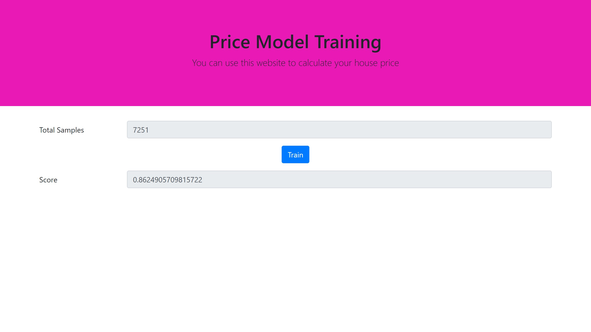
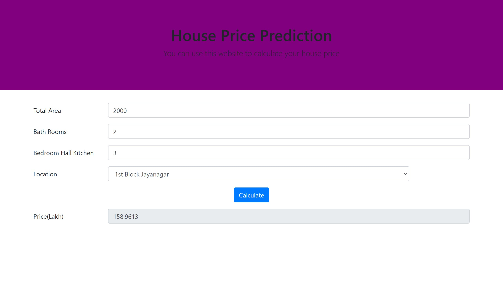
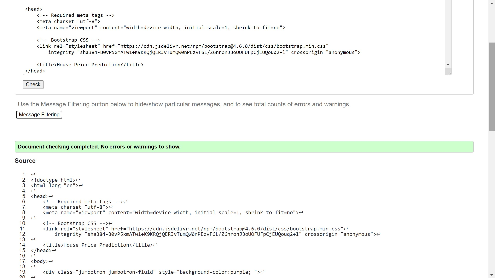
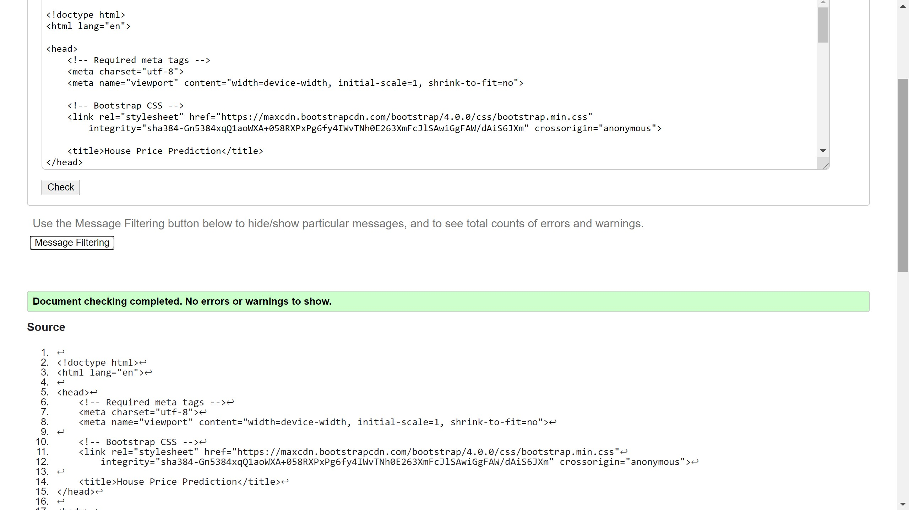

# House Price Prediction
## AIM:
To design a website to train the house price model and to predict the price.

## DESIGN STEPS:
### Step 1: 
Requirement collection.
### Step 2:
Creating the layout using HTML and CSS.
### Step 3:
Train the model using the given data set
### Step 4:
Save the trained model using pickle
### Step 5:
Get the input from the user
### Step 6:
Load the trained model using pickle
### Step 7:
Apply the given data to the model
### Step 8:
Display the result
### Step 9:
Publish the website in the given URL.

## PROGRAM:
## HouseModelpredicting
```
<!doctype html>
<html lang="en">

<head>
    <!-- Required meta tags -->
    <meta charset="utf-8">
    <meta name="viewport" content="width=device-width, initial-scale=1, shrink-to-fit=no">

    <!-- Bootstrap CSS -->
    <link rel="stylesheet" href="https://cdn.jsdelivr.net/npm/bootstrap@4.6.0/dist/css/bootstrap.min.css"
        integrity="sha384-B0vP5xmATw1+K9KRQjQERJvTumQW0nPEzvF6L/Z6nronJ3oUOFUFpCjEUQouq2+l" crossorigin="anonymous">

    <title>House Price Prediction</title>
</head>

<body>

    <div class="jumbotron jumbotron-fluid" style="background-color:purple; ">

        <div class="container text-center">
            <h1>House Price Prediction</h1>
            <p class="lead">You can use this website to calculate your house price</p>
        </div>
    </div>
    <div class="container">
        <form action="/HouseModelPrediction/" method="POST">
            
            <div class="form-group row">
                <label for="area" class="col-md-2 col-form-label">Total Area</label>
                <div class="col-md-10">
                    <input type="text" class="form-control" id="area" name="area" placeholder="1500" value="{{area}}">
                </div>
            </div>
            <div class="form-group row">
                <label for="bathrooms" class="col-md-2 col-form-label">Bath Rooms</label>
                <div class="col-md-10">
                    <input type="text" class="form-control" id="bathrooms" name="bathrooms" placeholder="2"
                        value="{{bathrooms}}">
                </div>
            </div>
            <div class="form-group row">
                <label for="bhk" class="col-md-2 col-form-label">Bedroom Hall Kitchen</label>
                <div class="col-md-10">
                    <input type="text" class="form-control" id="bhk" name="bhk" placeholder="3" value="{{bhk}}">
                </div>
            </div>
            <div class="form-group row">
                <label for="location" class="col-md-2 col-form-label">Location</label>
                <div class="col-md-10">
                    <select id="location" name="location" class="col-md-10 form-control">
                        

                        
                        <option selected value="{{loc}}">{{loc}}</option>
                        
                        <option value="{{loc}}">{{loc}}</option>
                        
                        
                    </select>
                </div>
            </div>
            <div class="form-group row text-center">
                <div class="col-md-12">
                    <button type="submit" class="btn btn-primary">Calculate</button>
                </div>
            </div>
            <div class="form-group row">
                <label for="price" class="col-md-2 col-form-label">Price(Lakh)</label>
                <div class="col-md-10">
                    <input type="text" readonly class="form-control" id="price" placeholder="-" value="{{price}}">
                </div>
            </div>
        </form>
    </div>


    <!-- Optional JavaScript; choose one of the two! -->

    <!-- Option 1: jQuery and Bootstrap Bundle (includes Popper) -->
    <script src="https://code.jquery.com/jquery-3.5.1.slim.min.js"
        integrity="sha384-DfXdz2htPH0lsSSs5nCTpuj/zy4C+OGpamoFVy38MVBnE+IbbVYUew+OrCXaRkfj"
        crossorigin="anonymous"></script>
    <script src="https://cdn.jsdelivr.net/npm/bootstrap@4.6.0/dist/js/bootstrap.bundle.min.js"
        integrity="sha384-Piv4xVNRyMGpqkS2by6br4gNJ7DXjqk09RmUpJ8jgGtD7zP9yug3goQfGII0yAns"
        crossorigin="anonymous"></script>

    <!-- Option 2: Separate Popper and Bootstrap JS -->
    <!--
    <script src="https://code.jquery.com/jquery-3.5.1.slim.min.js" integrity="sha384-DfXdz2htPH0lsSSs5nCTpuj/zy4C+OGpamoFVy38MVBnE+IbbVYUew+OrCXaRkfj" crossorigin="anonymous"></script>
    <script src="https://cdn.jsdelivr.net/npm/popper.js@1.16.1/dist/umd/popper.min.js" integrity="sha384-9/reFTGAW83EW2RDu2S0VKaIzap3H66lZH81PoYlFhbGU+6BZp6G7niu735Sk7lN" crossorigin="anonymous"></script>
    <script src="https://cdn.jsdelivr.net/npm/bootstrap@4.6.0/dist/js/bootstrap.min.js" integrity="sha384-+YQ4JLhjyBLPDQt//I+STsc9iw4uQqACwlvpslubQzn4u2UU2UFM80nGisd026JF" crossorigin="anonymous"></script>
    -->
</body>

</html>
```
## HouseModelTraining
```
<!doctype html>
<html lang="en">

<head>
    <!-- Required meta tags -->
    <meta charset="utf-8">
    <meta name="viewport" content="width=device-width, initial-scale=1, shrink-to-fit=no">

    <!-- Bootstrap CSS -->
    <link rel="stylesheet" href="https://maxcdn.bootstrapcdn.com/bootstrap/4.0.0/css/bootstrap.min.css"
        integrity="sha384-Gn5384xqQ1aoWXA+058RXPxPg6fy4IWvTNh0E263XmFcJlSAwiGgFAW/dAiS6JXm" crossorigin="anonymous">

    <title>House Price Prediction</title>
</head>

<body>
    <div class="jumbotron jumbotron-fluid" style="background-color:rgb(233, 25, 181);">
        <div class="container text-center">
            <h1>Price Model Training</h1>
            <p class="lead">You can use this website to calculate your house price</p>
        </div>
    </div>
    <div class="container">
        <form action="/HouseModelTraining/" method="POST">
            
            <div class="form-group row">
                <label for="samples" class="col-md-2 col-form-label">Total Samples</label>
                <div class="col-md-10">
                    <input type="text" readonly class="form-control" id="samples" placeholders="-" value="{{samples}}">
                </div>
            </div>
            <div class="form-group row text-center">
                <div class="col-md-12">
                    <button type="submit" class="btn btn-primary">Train</button>
                </div>
            </div>
            <div class="form-group row">
                <label for="score" class="col-md-2 col-form-label">Score</label>
                <div class="col-md-10">
                    <input type="text" readonly class="form-control" id="score" placeholders="-" value="{{score}}">
                </div>
            </div>
        </form>
    </div>

    <!-- Optional JavaScript -->
    <!-- jQuery first, then Popper.js, then Bootstrap JS -->
    <script src="https://code.jquery.com/jquery-3.2.1.slim.min.js"
        integrity="sha384-KJ3o2DKtIkvYIK3UENzmM7KCkRr/rE9/Qpg6aAZGJwFDMVNA/GpGFF93hXpG5KkN"
        crossorigin="anonymous"></script>
    <script src="https://cdnjs.cloudflare.com/ajax/libs/popper.js/1.12.9/umd/popper.min.js"
        integrity="sha384-ApNbgh9B+Y1QKtv3Rn7W3mgPxhU9K/ScQsAP7hUibX39j7fakFPskvXusvfa0b4Q"
        crossorigin="anonymous"></script>
    <script src="https://maxcdn.bootstrapcdn.com/bootstrap/4.0.0/js/bootstrap.min.js"
        integrity="sha384-JZR6Spejh4U02d8jOt6vLEHfe/JQGiRRSQQxSfFWpi1MquVdAyjUar5+76PVCmYl"
        crossorigin="anonymous"></script>
</body>

</html>
```

## OUTPUT:




## code validator





## RESULT:
Thus a website is designed for the house price training and house price prectition and is hosted in the URL http://dhayanitha.student.saveetha.in:8000/HouseModelTraining and http://dhayanitha.student.saveetha.in:8000/HouseModelPrediction. HTML code is validated.